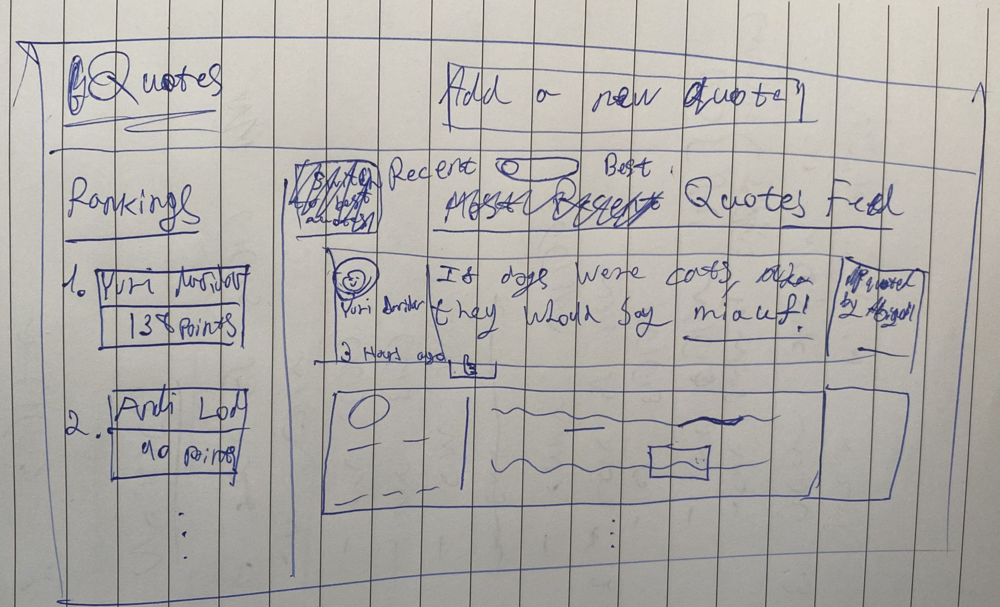

# Quote Me

## Idea

### What is my website about?

- This is a website of quotes.
- Its main purpose is to be a fun place for saving iconic quates.
- Optional names:
  - Quote Me
  - Iconic!

### What information am I presenting on the subject?

- Most recent quotes
- Top quotes
- For each quote:
  - Who said that? Name + picture
  - When was the quote uploaded?
  - The quote itself
  - How many people liked it?
  - How many peaple think it is superb?
  - Who uploded the quote?
- Hall of fame of the most iconic people (With the most quotes and likes)
  - The iconicity level of one will be calculated as:
    - For each quote: 3 points
    - For each like: 1 point
    - For each superb: 2 points

### What does the website looks like?

- There is a main theme color
- As far as a quote is more iconic, it will glow more
- The top row containes a logo and a "New Quote" button
- A table is present on the left side of the screen with the hall of fame
- The main part of the page is the feed, it can be customized:
  - Sorting (toggle): recent, best

## Design

### Paper Prototype

### Text

Most of the text is in the prototype.

### Color Theme

- The website has a pink/purpole color theme: 

- The backround is light grey

### Logo

### Font
The font is David CLM
